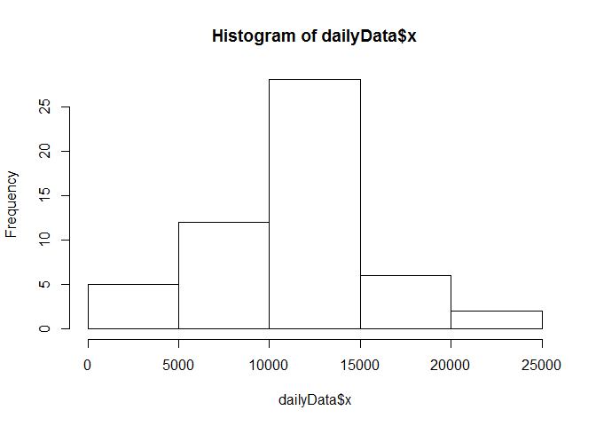
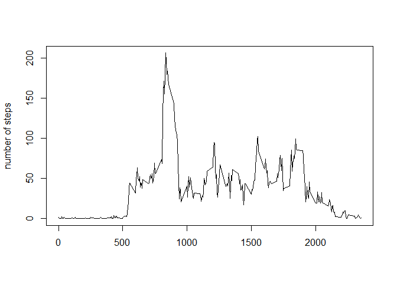
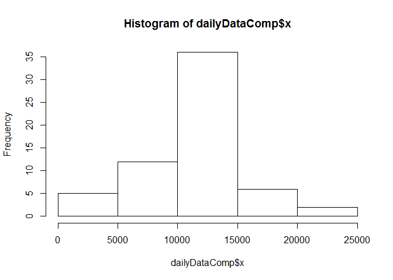
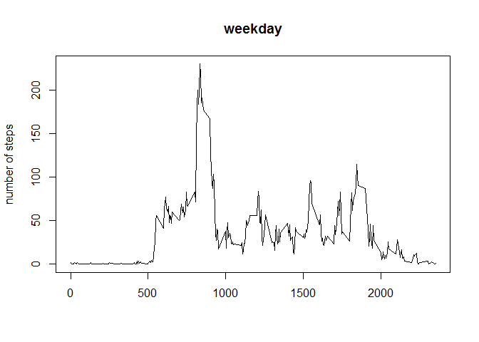
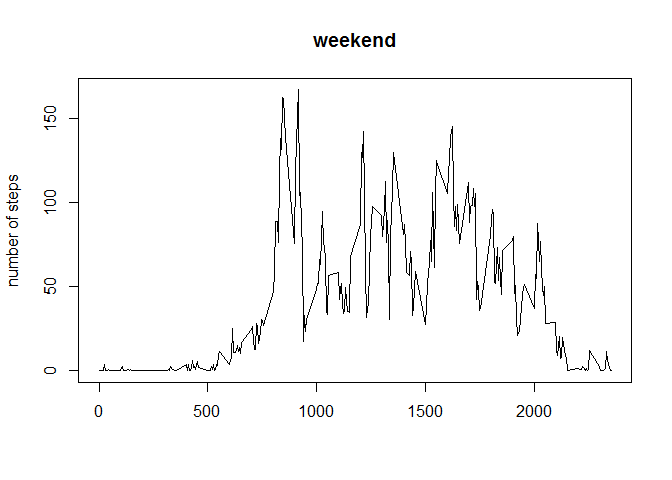

# Reproducible Research Peer Assessment 1


## Loading and preprocessing the data


```r
stepData <- read.csv("F:/Coursera/Data Science JHU/reproducible research/activity.csv")
```
## What is mean total number of steps taken per day?


```r
dailyData<-aggregate(stepData$steps, by = list(stepData$date), FUN = sum)

hist(dailyData$x)
```

 

```r
mean(dailyData$x,na.rm =TRUE)
```

```
## [1] 10766
```

```r
median(dailyData$x,na.rm =TRUE)
```

```
## [1] 10765
```


## What is the average daily activity pattern?

```r
patternData <- aggregate(stepData$steps, by = list(stepData$interval), FUN = mean,na.rm = TRUE)

plot( patternData$Group.1,patternData$x, type = "l",xlab = "", ylab = "number of steps")
```

 

```r
patternData[patternData$x == max(patternData$x ),]
```

```
##     Group.1     x
## 104     835 206.2
```

## Imputing missing values

```r
sum(is.na(stepData[,"steps"]))
```

```
## [1] 2304
```

```r
m <- nrow(stepData)
stepDataComp <- stepData
for (i in 1:m){
if (is.na(stepData[i,"steps"]))
    stepDataComp[i,"steps"] <- patternData[patternData[,1]== stepDataComp[i,"interval"] ,"x"] 
}
sum(is.na(stepDataComp[,"steps"]))
```

```
## [1] 0
```

```r
dailyDataComp<-aggregate(stepDataComp$steps, by = list(stepDataComp$date), FUN = sum)
hist(dailyDataComp$x)
```

 

```r
mean(dailyDataComp$x,na.rm =TRUE)
```

```
## [1] 10766
```

```r
median(dailyDataComp$x,na.rm =TRUE)
```

```
## [1] 10766
```

## Are there differences in activity patterns between weekdays and weekends?


```r
weekend <- weekdays(as.Date(stepDataComp$date)) %in% c("Saturday", "Sunday") ## set up logical/test vector

stepDataComp$daytype[weekend == TRUE] <- "weekend" ## replace "weekday" with "weekend" where day == Sat/Sun
stepDataComp$daytype[weekend == FALSE] <- "weekday"

weekEnd <- subset(stepDataComp, daytype == "weekend")
weekEndMean <- aggregate(steps ~ interval, data = weekEnd, mean)
weekDay <- subset(stepDataComp, daytype == "weekday")
weekDayMean <- aggregate(steps ~ interval, data = weekDay, mean)

total <- merge(weekEndMean,weekDayMean)
plot( weekDayMean$interval,weekDayMean$steps, type = "l",main = "weekday",xlab = "", ylab = "number of steps")
```

 

```r
plot( weekEndMean$interval,weekEndMean$steps, type = "l",main = "weekend",xlab = "", ylab = "number of steps")
```

 

